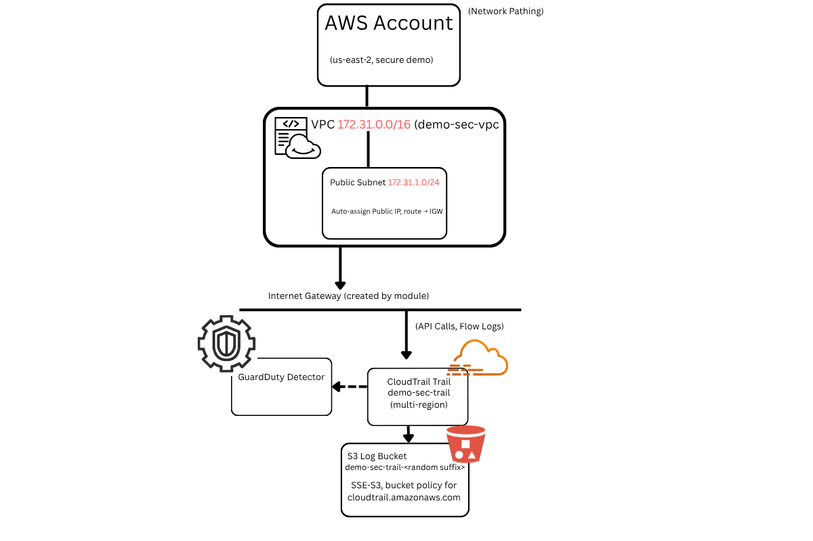

# Secure Baselines Portfolio
ANSIBLE Docker Benchmark

Runs CIS Docker Benchmark via docket-bench-security
Outputs JSON to /tmp/bench.json for SIEM ingestion
One-command hardening check: ansible-playbook docker-bench.yml


AWS SECURE BASELINE:
# AWS Secure Baseline (Terraform Demo)

A **repeatable, minimum-viable secure AWS environment** built with Terraform to showcase Infrastructure-as-Code skills.

All resources + tags live in main.tf—single command reproducible; no drift.

---

## 🔐 What It Deploys

| Control | Why It Matters |
|---------|----------------|
| **VPC + Public Subnet** | Network segmentation; future workloads inherit secure defaults. | 
| **CloudTrail (central log bucket)** | Immutable, multi-region audit trail for HIPAA / compliance evidence. | CloudTrail → S3
Bucket policy follows AWS guidance
https://docs.aws.amazon.com/awscloudtrail/latest/userguide/create-s3-bucket-policy-for-cloudtrail.html
This ensures that cloudtrail.amazonaws.com can only write with bucket-owner-full-control.
| **GuardDuty Detector** | Managed threat-intel alerts with zero extra agents (“plug-and-play” IDS). | Enabled detector monitors API calls, IAM anomalies, port scans, credential leaks, etc.
Low-ops cost; scales automatically.


---

## 🚀 Quick Start

```bash
# Prereqs: Terraform ≥1.2, AWS CLI with creds in us-east-2
terraform init
terraform apply -auto-approve     # ~60 sec
# ... verify resources ...
terraform destroy -auto-approve   # clean up
```

Next Steps for Prod Environment:
- Add AWS Config rules for CIS Benchmarks
- Route S3 logs to SIEM via S3 event-based lambda to ensure that all security applications are      reporting to a single location
- Extend module with private subnets + NAT + Security Groups to lock down environment even more


AZURE POLICIES FOR HIPAA COMPLIANCE:
| HIPAA Control | Azure Policy |
|---------------|--------------|
| 164.312(a)(2)(iv) Encryption at rest | EncryptDisks |
| 164.312(e)(1) Transmission security | RequireSecureTransfer |


Mapping to Essential Eight (Maturity Level 1): Essential Eight was chosen due to familiarity with compliance needs

| E8 Strategy                | Script Action                         |
|----------------------------|--------------------------------------|
| Application Control        | AppLocker default rules enabled      |
| Configure Microsoft Office | Macro blocking via registry (VBA=4)  |
| Application Hardening      | Disable WDigest, SMBv1               |
| Restrict Admin Privileges  | Script can drop current user from Administrators (commented) |

Future work: integrate WSUS patch enforcement, MFA via Azure AD Conditional Access, and VSS backup verification.


